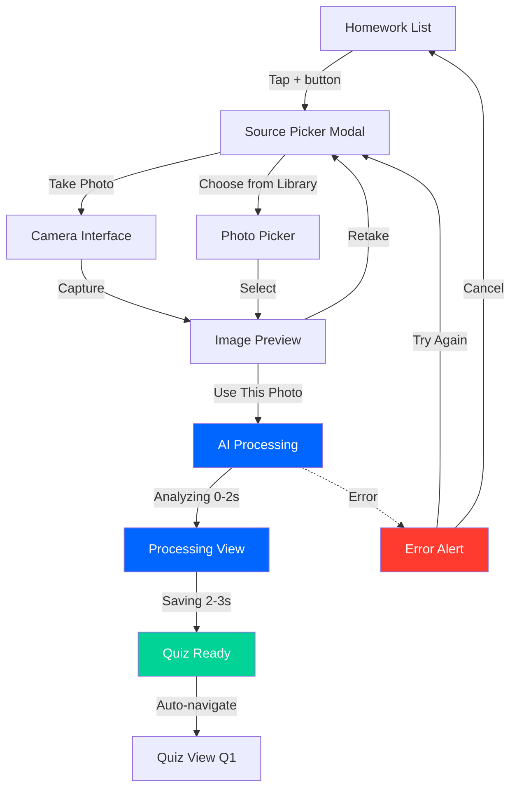
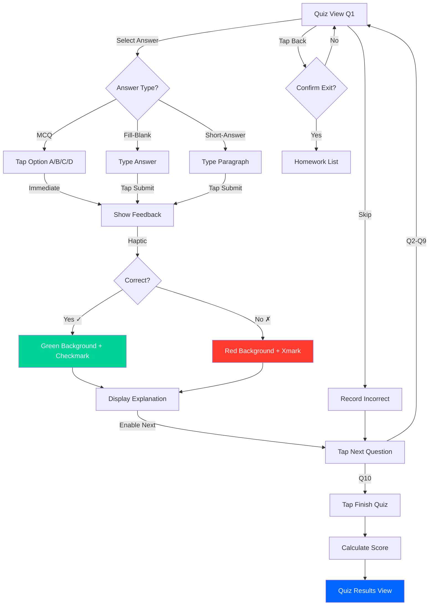
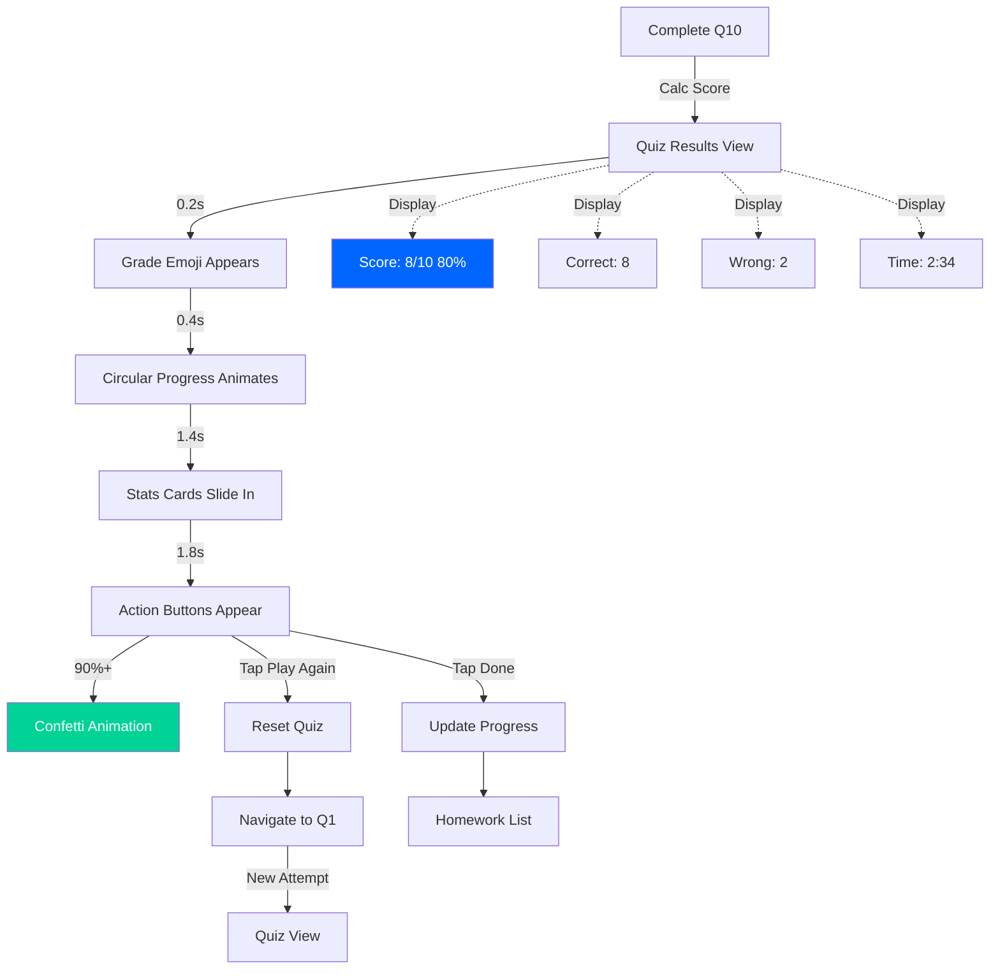
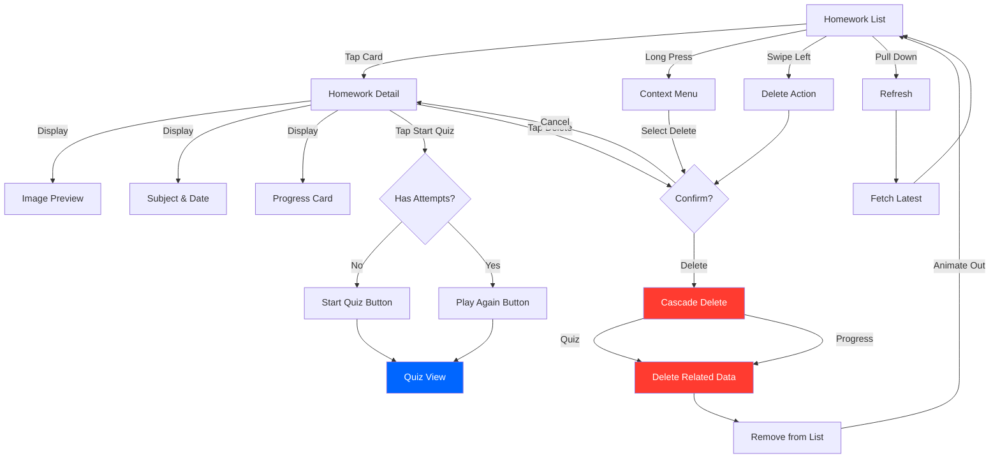

# Cheater Project - AI Assistant Guide

> **IMPORTANT**: All project documentation and instructions are in the [docs/](docs/) folder. The "Project definition" folder and "Cheater-iOS" folder contain legacy/outdated information and should be ignored. Always refer to the docs folder for current, accurate information.

## Quick Start

When working on this project, **ALWAYS** consult these documentation files in order:

1. [docs/00-OVERVIEW.md](docs/00-OVERVIEW.md) - Project vision, features, and architecture
2. [docs/01-DATA-MODELS.md](docs/01-DATA-MODELS.md) - All data structures (Homework, Quiz, Question, etc.)
3. [docs/02-API-INTEGRATION.md](docs/02-API-INTEGRATION.md) - Claude Vision API integration patterns
4. [docs/03-PROMPTS-SYSTEM.md](docs/03-PROMPTS-SYSTEM.md) - Intelligent prompting system
5. [docs/04-DESIGN-SYSTEM.md](docs/04-DESIGN-SYSTEM.md) - Design tokens, UI components, and patterns
6. [docs/05-DATABASE-SCHEMA.md](docs/05-DATABASE-SCHEMA.md) - Database schema and relationships

> **Note**: User flows are now visualized as Mermaid diagrams in this document (see [User Flows](#user-flows) section). Archived documentation (migration guide, detailed user flows) can be found in [docs/archived/](docs/archived/).

## Project Overview

**Cheater** is an AI-powered educational app that transforms homework assignments into interactive quizzes using Claude AI's Vision API.

### Core Features
- **Camera Capture**: Photo homework or choose from library
- **Smart Quiz Classification**: Auto-detects topic (Maths, English, Science, History) and adapts question types
- **Multi-Format Questions**: MCQ, fill-in-blank, short-answer
- **Progress Tracking**: Best scores, completion rates, attempts
- **Adaptive Learning**: Special handling for spelling lists, math worksheets, etc.

### Technology Stack

#### Current (iOS)
- **Language**: Swift 5.9+
- **UI**: SwiftUI
- **State**: @Published, @StateObject
- **Async**: Swift Concurrency (async/await, Actor)
- **Database**: Core Data
- **API**: Claude Vision API (Anthropic)

#### React Native (In Progress → MVP Complete)
- **Language**: TypeScript
- **UI**: React Native + Expo
- **State**: Zustand
- **Database**: Supabase (PostgreSQL)
- **Navigation**: Expo Router
- **Status**: Full MVP complete with all core features working

#### Next.js Web (Current → Active Development)
- **Framework**: Next.js 16 with App Router + Turbopack
- **Language**: TypeScript
- **UI**: React + Tailwind CSS v4 + Radix UI
- **State**: Zustand (shared with React Native)
- **Database**: Supabase (PostgreSQL) - shared with React Native
- **Animations**: Framer Motion
- **Design**: Headway-inspired (modern consumer web app)
- **Responsive**: Desktop sidebar + Mobile bottom nav
- **Status**: MVP complete with full-featured responsive layouts

## Architecture Principles

### Separation of Concerns
1. **Models**: Pure data structures (see [01-DATA-MODELS.md](docs/01-DATA-MODELS.md))
2. **Services**: Business logic and external APIs (see [02-API-INTEGRATION.md](docs/02-API-INTEGRATION.md))
3. **ViewModels**: State management
4. **Views**: Presentation only

### Key Services
- **AIService**: Claude Vision API integration, image processing, quiz generation
- **PromptManager**: Loads and builds topic-specific prompts from `shared/config/Prompts.json`
- **PersistenceController**: Core Data management (iOS) or Supabase (React Native)

## Data Models

### Core Entities
All models use:
- **UUIDs** for IDs
- **ISO 8601** dates
- **Optional fields** marked with `?`
- **Validation functions** for each model
- **Type safety** (TypeScript/Swift)

#### Homework
```typescript
{
  id: string;
  title: string;
  subject?: string;
  imageURL: string;
  ocrText?: string;
  createdAt: Date;
  bestScore?: number;
  totalAttempts: number;
  completionPercentage: number;
  lastPlayedAt?: Date;
}
```

#### Quiz
```typescript
{
  id: string;
  homeworkId: string;
  questions: Question[];  // Exactly 10
  createdAt: Date;
  topic?: string;         // "maths", "english", "science", "history", "generic"
  subtopic?: string;      // "algebra", "grammar", etc.
  classificationConfidence?: number;
}
```

#### Question
```typescript
{
  id: string;
  type: "mcq" | "fillBlank" | "shortAnswer";
  question: string;

  // For MCQ only
  options?: string[];      // Exactly 4 options
  correctIndex?: number;   // 0-3

  // For fillBlank and shortAnswer
  correctAnswer?: string;

  explanation: string;
}
```

**Full details**: [docs/01-DATA-MODELS.md](docs/01-DATA-MODELS.md)

## API Integration

### Claude Vision API

**Endpoint**: `https://api.anthropic.com/v1/messages`
**Model**: `claude-sonnet-4-20250514`
**Timeout**: 60 seconds

### Image Processing Pipeline
```
Original Image
    ↓
Resize (max 1280px)
    ↓
Convert to JPEG (75% quality)
    ↓
Base64 Encode
    ↓
Send to Claude API
```

### Request Format
```json
{
  "model": "claude-sonnet-4-20250514",
  "max_tokens": 4096,
  "messages": [{
    "role": "user",
    "content": [
      {
        "type": "image",
        "source": {
          "type": "base64",
          "media_type": "image/jpeg",
          "data": "<base64_image>"
        }
      },
      {
        "type": "text",
        "text": "<vision_prompt>"
      }
    ]
  }]
}
```

### Cost Per Quiz
- Input: ~$0.006 (2,000 tokens)
- Output: ~$0.032 (2,100 tokens)
- **Total**: ~$0.04 per quiz

**Full details**: [docs/02-API-INTEGRATION.md](docs/02-API-INTEGRATION.md)

## Prompts System

### Configuration Files
- **`shared/config/Prompts.json`**: Topic-specific prompt templates
- **`shared/config/TrainingData.json`**: Example homework types with strategies

### Topic-Specific Question Distributions

| Topic   | MCQ  | Fill-Blank | Short-Answer |
|---------|------|------------|--------------|
| Maths   | 60%  | 30%        | 10%          |
| English | 40%  | 40%        | 20%          |
| Science | 50%  | 30%        | 20%          |
| History | 50%  | 20%        | 30%          |
| Generic | 60%  | 25%        | 15%          |

### Special Cases
- **Spelling Lists**: Detected automatically, generates 90% MCQ with spelling variations
- **Math Worksheets**: Emphasizes fill-blank for calculations
- **Reading Comprehension**: More short-answer questions

### Smart Title Generation
- `"Maths - Algebra"`
- `"Spelling Practice"`
- `"Science - Biology"`
- `"History - World War 2"`

**Full details**: [docs/03-PROMPTS-SYSTEM.md](docs/03-PROMPTS-SYSTEM.md)

## Design System

### iOS-Native Design Philosophy
1. **Clarity**: Content is paramount
2. **Deference**: UI defers to content
3. **Depth**: Visual layers convey hierarchy
4. **Consistency**: Familiar iOS patterns
5. **Performance**: 60fps animations always

### Color Palette
```typescript
Colors = {
  primary: '#007AFF',        // iOS Blue
  success: '#34C759',        // iOS Green
  error: '#FF3B30',          // iOS Red
  warning: '#FF9500',        // iOS Orange

  // Adaptive (light/dark)
  background: { light: '#FFFFFF', dark: '#000000' },
  cardBackground: { light: '#FFFFFF', dark: '#1C1C1E' },
  textPrimary: { light: '#000000', dark: '#FFFFFF' },
  textSecondary: '#8E8E93',
}
```

### Typography (SF Pro Style)
- **Large Title**: 34pt, Bold
- **Title 1**: 28pt, Regular
- **Headline**: 17pt, Semibold
- **Body**: 17pt, Regular
- **Callout**: 16pt, Regular
- **Footnote**: 13pt, Regular

### Spacing (8px base)
```typescript
Spacing = {
  tiny: 4,
  small: 8,
  medium: 16,
  large: 24,
  xLarge: 32,
  xxLarge: 48
}
```

### Spring Animations
```typescript
Spring.default = {
  damping: 0.7,
  stiffness: 300,
  mass: 1,
  response: 0.3
}
```

### Haptic Feedback
- **Light**: Button press
- **Medium**: Selection
- **Heavy**: Significant action
- **Success**: Correct answer
- **Error**: Wrong answer

**Full details**: [docs/04-DESIGN-SYSTEM.md](docs/04-DESIGN-SYSTEM.md)

## User Flows

### 1. Camera Capture Flow



**Key States:**
- **Processing**: Shows spinner, "Analyzing Homework..." message
- **Saving**: Brief save state before completion
- **Complete**: Checkmark icon, auto-navigate after 1s
- **Error**: Alert with retry option, returns to source picker

**Timeline**: Total 3-4 seconds from photo to quiz

---

### 2. Quiz Gameplay Flow



**Question Types:**
- **MCQ**: 4 options (A/B/C/D), single selection
- **Fill-Blank**: Text field, exact match (case-insensitive)
- **Short-Answer**: Multi-line editor, concept matching

**Progress Tracking:**
- Progress bar: 10% → 20% → ... → 100%
- Question counter: "Question X of 10"
- Time tracking: Starts on Q1, stops on completion

---

### 3. Results & Review Flow



**Grade Emojis:**
- 90-100%: 🎉 "Excellent!"
- 70-89%: 👍 "Great Job!"
- 50-69%: 👌 "Good Effort!"
- 0-49%: 💪 "Keep Practicing!"

**Progress Ring Colors:**
- 90%+: Green (#00D395)
- 70%+: Blue (#0066FF)
- 50%+: Orange (#FF9500)
- <50%: Red (#FF3B30)

**Database Updates:**
- Increment `totalAttempts`
- Update `lastPlayedAt`
- Update `bestScore` (max)
- Update `completionPercentage` (max)

---

### 4. Homework Management Flow



**Card Information:**
- Title (e.g., "Maths - Algebra")
- Subject badge
- Created date
- Progress bar + percentage
- Best score (if attempted)
- Attempt count

**Delete Confirmation:**
- Title: "Delete Homework?"
- Message: "This will delete the homework, quiz, and all progress."
- Actions: Cancel | Delete (red, destructive)

---

### Interaction Patterns

**Gestures:**
- **Swipe Right**: Back navigation (edge)
- **Swipe Down**: Dismiss modal
- **Swipe Left**: Delete (iOS list item)
- **Long Press**: Context menu (homework card)
- **Tap**: Standard interaction

**Haptic Feedback:**
| Action | Type |
|--------|------|
| Button press | Light impact |
| Correct answer | Success notification |
| Wrong answer | Error notification |
| Quiz complete | Success (90%+) or Warning |
| Delete | Medium impact |
| Navigation | Light impact |
| Text focus | Selection |

---

## Coding Conventions

### File Structure
```
Project/
├── Models/          # Data structures
├── Services/        # Business logic (AIService, PromptManager)
├── ViewModels/      # State management (@Published)
├── Views/           # UI components
└── Config/          # Symlink to shared/config/
```

### Naming Conventions

#### Swift
- **Files**: PascalCase (e.g., `HomeworkListView.swift`)
- **Classes/Structs**: PascalCase (e.g., `AIService`, `Homework`)
- **Functions**: camelCase (e.g., `generateQuiz()`, `loadHomework()`)
- **Properties**: camelCase (e.g., `bestScore`, `totalAttempts`)
- **Constants**: camelCase with `let` (e.g., `let apiURL`)

#### TypeScript/React Native/Next.js Web
- **Files**: PascalCase for components (e.g., `HomeworkCard.tsx`)
- **Files**: camelCase for services (e.g., `aiService.ts`)
- **Files**: `page.tsx` for Next.js routes (convention)
- **Interfaces**: PascalCase (e.g., `interface Homework {}`)
- **Functions**: camelCase (e.g., `generateQuiz()`, `loadHomework()`)
- **Components**: PascalCase (e.g., `HomeworkCard`, `AnswerButton`)
- **Hooks**: camelCase with `use` prefix (e.g., `useColors()`, `useHomeworkStore()`)

### Code Sharing: React Native vs Next.js Web

**Shared Code** (identical in both):
- **Types**: `types/index.ts` - All TypeScript interfaces
- **Stores**: `stores/*.ts` - Zustand state management (identical API)
- **Services**: `services/*DB.ts` - Supabase CRUD operations (identical)
- **Data Models**: Homework, Quiz, Question validation logic

**Platform-Specific Code**:
- **UI Components**: React Native uses `View`, `Text`, `StyleSheet`; Next.js uses HTML + Tailwind
- **Navigation**: React Native uses Expo Router; Next.js uses built-in routing
- **Image Processing**: React Native uses native modules; Next.js uses Canvas API
- **API Calls**: React Native calls Claude directly; Next.js uses server-side proxy

**Example: Shared Zustand Store**
```typescript
// ✅ This code works in BOTH React Native and Next.js
import { create } from 'zustand';

export const useHomeworkStore = create<HomeworkState>((set) => ({
  homework: [],
  isLoading: false,

  loadHomework: async () => {
    set({ isLoading: true });
    const homework = await HomeworkDB.getAll();  // Works in both!
    set({ homework, isLoading: false });
  }
}));
```

**Example: Platform-Specific UI**
```typescript
// React Native
import { View, Text, StyleSheet } from 'react-native';

export const HomeworkCard = ({ homework }) => (
  <View style={styles.card}>
    <Text style={styles.title}>{homework.title}</Text>
  </View>
);

const styles = StyleSheet.create({
  card: { padding: 16, borderRadius: 12 }
});

// Next.js Web
export const HomeworkCard = ({ homework }) => (
  <div className="p-4 rounded-xl bg-white shadow-sm">
    <h3 className="text-lg font-semibold">{homework.title}</h3>
  </div>
);
```

### Code Style

#### SwiftUI Views
```swift
struct HomeworkCardView: View {
    let homework: Homework

    var body: some View {
        HStack(spacing: 16) {
            thumbnail
            content
        }
        .padding(16)
        .background(Color.appCardBackground)
        .cornerRadius(16)
    }

    private var thumbnail: some View {
        // Extract complex views
    }
}
```

#### React Native Components
```typescript
export const HomeworkCard: React.FC<{ homework: Homework }> = ({ homework }) => {
  const colors = useColors();

  return (
    <View style={[styles.card, { backgroundColor: colors.cardBackground }]}>
      {/* Content */}
    </View>
  );
};

const styles = StyleSheet.create({
  card: {
    padding: Spacing.medium,
    borderRadius: Radius.card,
    ...Shadow.card
  }
});
```

### Async Patterns

#### Swift
```swift
// Use async/await
func loadHomework() async throws -> [Homework] {
    let data = try await fetchData()
    return parseHomework(data)
}

// Use Actor for thread safety
actor AIService {
    func generateQuiz() async throws -> Quiz { }
}
```

#### TypeScript
```typescript
// Use async/await with try-catch
async function loadHomework(): Promise<Homework[]> {
  try {
    const data = await fetchData();
    return parseHomework(data);
  } catch (error) {
    throw new AIServiceError(error);
  }
}
```

### Error Handling

#### Swift
```swift
enum AIError: Error {
    case invalidRequest
    case networkError
    case parsingError
}

do {
    let quiz = try await aiService.generateQuiz(from: image)
} catch {
    handleError(error)
}
```

#### TypeScript
```typescript
export class AIServiceError extends Error {
  constructor(
    public type: AIError,
    message: string,
    public statusCode?: number
  ) {
    super(message);
  }
}

try {
  const quiz = await aiService.generateQuiz(imageUri);
} catch (error) {
  if (error instanceof AIServiceError) {
    showUserError(error);
  }
}
```

## State Management

### iOS (SwiftUI)
```swift
@MainActor
class HomeworkListViewModel: ObservableObject {
    @Published var homework: [Homework] = []
    @Published var isLoading = false
    @Published var errorMessage: String?

    func loadHomework() async {
        isLoading = true
        // Load data
        isLoading = false
    }
}
```

### React Native (Zustand)
```typescript
export const useHomeworkStore = create<HomeworkState>((set, get) => ({
  homework: [],
  isLoading: false,
  error: null,

  loadHomework: async () => {
    set({ isLoading: true });
    const homework = await HomeworkDB.getAll();
    set({ homework, isLoading: false });
  }
}));
```

### Next.js Web (Zustand)
```typescript
// Same Zustand stores as React Native
export const useHomeworkStore = create<HomeworkState>((set, get) => ({
  homework: [],
  isLoading: false,
  error: null,

  loadHomework: async () => {
    set({ isLoading: true });
    const homework = await HomeworkDB.getAll();
    set({ homework, isLoading: false });
  }
}));
```

## Next.js Web Architecture

### File Structure
```
cheater-web/
├── app/                      # Next.js App Router
│   ├── layout.tsx           # Root layout
│   ├── page.tsx             # Homepage (homework list)
│   ├── capture/             # Image upload
│   │   └── page.tsx
│   ├── quiz/[id]/           # Dynamic quiz route
│   │   └── page.tsx
│   ├── library/             # Homework library
│   │   └── page.tsx
│   └── api/                 # API routes (server-side)
│       └── generate-quiz/   # Proxy to Claude API
│           └── route.ts
├── components/
│   ├── ui/                  # Radix UI primitives
│   │   ├── button.tsx
│   │   ├── card.tsx
│   │   └── ...
│   ├── AppLayout.tsx        # Responsive layout wrapper
│   └── ThemeToggle.tsx      # Dark mode toggle
├── stores/                  # Zustand stores (shared with RN)
│   ├── homeworkStore.ts
│   ├── quizStore.ts
│   └── captureStore.ts
├── services/                # Business logic
│   ├── aiService.ts         # Claude API client
│   ├── supabase.ts          # Supabase client
│   ├── homeworkDB.ts        # Homework CRUD
│   └── quizDB.ts            # Quiz CRUD
├── lib/                     # Utilities
│   ├── tokens.ts            # Design tokens
│   ├── utils.ts             # cn() helper
│   └── motion.ts            # Framer Motion presets
├── types/                   # TypeScript types (shared)
│   └── index.ts
└── styles/                  # Global styles
    └── globals.css
```

### Key Patterns

#### 1. Server-Side API Proxy
**Problem**: Browser can't directly call Claude API due to CORS
**Solution**: Next.js API route acts as server-side proxy

```typescript
// app/api/generate-quiz/route.ts
export async function POST(request: Request) {
  const { imageBase64 } = await request.json();

  // Call Claude API from server (no CORS)
  const response = await axios.post(
    'https://api.anthropic.com/v1/messages',
    {
      model: 'claude-sonnet-4-5-20250929',
      max_tokens: 4096,
      messages: [{
        role: 'user',
        content: [
          { type: 'image', source: { type: 'base64', media_type: 'image/jpeg', data: imageBase64 } },
          { type: 'text', text: prompt }
        ]
      }]
    },
    {
      headers: {
        'x-api-key': process.env.ANTHROPIC_API_KEY,
        'anthropic-version': '2023-06-01',
        'content-type': 'application/json'
      }
    }
  );

  return NextResponse.json(response.data);
}
```

**Client calls API route**:
```typescript
const response = await axios.post('/api/generate-quiz', { imageBase64 });
```

#### 2. Responsive Layout Pattern
**Desktop**: Fixed left sidebar (288px) with main content offset
**Mobile**: Bottom navigation bar with floating action button

```typescript
// components/AppLayout.tsx
export function AppLayout({ children }: { children: React.ReactNode }) {
  return (
    <div className="min-h-screen bg-[#faf9f7]">
      {/* Desktop Sidebar - hidden on mobile */}
      <aside className="hidden lg:fixed lg:inset-y-0 lg:flex lg:w-72 lg:flex-col">
        {/* Nav items */}
      </aside>

      {/* Main Content - offset on desktop */}
      <main className="lg:pl-72">
        <div className="pb-20 lg:pb-0"> {/* Bottom padding for mobile nav */}
          {children}
        </div>
      </main>

      {/* Mobile Bottom Nav - hidden on desktop */}
      <nav className="fixed bottom-0 left-0 right-0 z-50 bg-white border-t lg:hidden">
        {/* Nav items + FAB */}
      </nav>
    </div>
  );
}
```

#### 3. Headway-Inspired Design System
**Implementation**: Custom design tokens in `lib/tokens.ts`

```typescript
export const colors = {
  // Brand Colors (Headway-inspired)
  primary: {
    DEFAULT: 'hsl(217, 100%, 52%)', // #0066FF Headway Blue
    hover: 'hsl(217, 100%, 48%)',
    tint: 'hsl(217, 100%, 52%, 0.1)',
  },
  success: {
    DEFAULT: 'hsl(160, 100%, 42%)', // #00D395 Headway Green
    hover: 'hsl(160, 100%, 38%)',
  },
  // ...
}

export const radius = {
  button: '0.75rem',  // 12px - rounded corners
  card: '1.5rem',     // 24px - more consumer-friendly
  modal: '1.75rem',   // 28px
}
```

**Usage in Tailwind**:
```tsx
<Button className="bg-primary hover:bg-primary-hover rounded-xl">
  New Quiz
</Button>

<Card className="rounded-2xl shadow-sm hover:shadow-md transition-shadow">
  {/* Card content */}
</Card>
```

#### 4. Image Processing (Browser-Based)
**Challenge**: Process images in browser before upload

```typescript
// services/aiService.ts
private async convertImageToBase64(imageUri: string): Promise<string> {
  return new Promise((resolve, reject) => {
    const img = new Image();
    img.crossOrigin = 'anonymous';

    img.onload = () => {
      // Calculate new dimensions (max 1280px)
      let width = img.width;
      let height = img.height;
      const maxDim = 1280;

      if (width > maxDim || height > maxDim) {
        if (width > height) {
          height = Math.round((height * maxDim) / width);
          width = maxDim;
        } else {
          width = Math.round((width * maxDim) / height);
          height = maxDim;
        }
      }

      // Create canvas and resize
      const canvas = document.createElement('canvas');
      canvas.width = width;
      canvas.height = height;
      const ctx = canvas.getContext('2d');
      ctx.drawImage(img, 0, 0, width, height);

      // Convert to JPEG base64 (0.75 quality)
      const dataUrl = canvas.toDataURL('image/jpeg', 0.75);
      const base64 = dataUrl.split(',')[1];

      resolve(base64);
    };

    img.src = imageUri;
  });
}
```

#### 5. Shared Supabase Client
**Same database as React Native** - Use Supabase client library

```typescript
// services/supabase.ts
import { createClient } from '@supabase/supabase-js';

export const supabase = createClient(
  process.env.NEXT_PUBLIC_SUPABASE_URL!,
  process.env.NEXT_PUBLIC_SUPABASE_ANON_KEY!
);

// services/homeworkDB.ts
export const HomeworkDB = {
  async getAll(): Promise<Homework[]> {
    const { data, error } = await supabase
      .from('homework')
      .select('*')
      .order('created_at', { ascending: false });

    if (error) throw error;
    return data.map(mapSupabaseToHomework);
  },

  async create(title: string, imageUrl: string, subject?: string): Promise<Homework> {
    const homework = {
      id: uuidv4(),
      title,
      image_url: imageUrl,
      subject,
      created_at: new Date().toISOString(),
      total_attempts: 0,
      completion_percentage: 0,
    };

    const { data, error } = await supabase
      .from('homework')
      .insert(homework)
      .select()
      .single();

    if (error) throw error;
    return mapSupabaseToHomework(data);
  }
};
```

#### 6. Framer Motion Animations
**Consistent animations across the app**

```typescript
// lib/motion.ts
export const fadeInUp = {
  initial: { opacity: 0, y: 20 },
  animate: { opacity: 1, y: 0 },
  transition: { duration: 0.3 }
};

export const staggerChildren = {
  animate: {
    transition: {
      staggerChildren: 0.05
    }
  }
};

// Usage in components
<motion.div {...fadeInUp}>
  <Card>Content</Card>
</motion.div>

<motion.div variants={staggerChildren}>
  {homework.map((item, index) => (
    <motion.div key={item.id} variants={fadeInUp}>
      <HomeworkCard homework={item} />
    </motion.div>
  ))}
</motion.div>
```

### Next.js Specific Conventions

#### File Naming
- **Pages**: `page.tsx` (Next.js App Router convention)
- **Layouts**: `layout.tsx` (wraps page content)
- **API Routes**: `route.ts` (server-side endpoints)
- **Components**: PascalCase (e.g., `HomeworkCard.tsx`)
- **Services**: camelCase (e.g., `aiService.ts`)
- **Stores**: camelCase with `Store` suffix (e.g., `homeworkStore.ts`)

#### Client vs Server Components
```typescript
// Client components (default in app/)
'use client'  // Required for hooks, state, event handlers

export default function CapturePage() {
  const [preview, setPreview] = React.useState<string | null>(null);
  // ...
}

// Server components (no 'use client')
// Can fetch data, access env vars, etc.
export default async function Page() {
  const data = await fetchData();
  return <div>{data}</div>;
}

// API routes (server-side only)
export async function POST(request: Request) {
  // Server-side logic
  return NextResponse.json({ success: true });
}
```

#### Environment Variables
```bash
# .env.local (never commit)
NEXT_PUBLIC_SUPABASE_URL=https://xxx.supabase.co
NEXT_PUBLIC_SUPABASE_ANON_KEY=eyJxxx...
NEXT_PUBLIC_ANTHROPIC_API_KEY=sk-ant-xxx  # Client-side access (for dev only)

# Server-side only (no NEXT_PUBLIC_ prefix)
ANTHROPIC_API_KEY=sk-ant-xxx  # Preferred for production
```

**IMPORTANT**: Use server-side API routes for production. Never expose API keys to client.

### Development Workflow

#### Starting Dev Server
```bash
cd cheater-web
npm run dev  # Starts on http://localhost:3000
```

#### Building for Production
```bash
npm run build  # Creates optimized production build
npm start      # Runs production build locally
```

#### Common Commands
```bash
npm run lint   # Run ESLint
npx tsx scripts/migrate.ts  # Run database migrations
```

### Deployment (Vercel)
1. Push to GitHub
2. Connect to Vercel
3. Set environment variables in Vercel dashboard
4. Automatic deployment on push to main

## Testing Strategy

### What to Test
1. **Data models**: Validation functions
2. **Services**: API calls, error handling
3. **ViewModels**: State transitions
4. **Components**: Rendering, user interactions
5. **Integration**: Full user flows

### What NOT to Test
- Third-party libraries
- Framework internals
- UI styling (visual regression tests instead)

## Common Tasks

### Adding a New Question Type
1. Update `QuestionType` enum in [01-DATA-MODELS.md](docs/01-DATA-MODELS.md)
2. Update validation logic in `Question` model
3. Update prompts in `shared/config/Prompts.json`
4. Update UI component to render new type
5. Update answer checking logic

### Adding a New Topic
1. Add topic to `Prompts.json` under `prompts.vision`
2. Define system message, instructions, requirements
3. Set distribution in `settings.questionTypeDistribution`
4. Add topic to `settings.topics` array
5. Update title generation logic

### Modifying Question Distribution
1. Edit `shared/config/Prompts.json`
2. Update `settings.questionTypeDistribution[topic]`
3. Ensure all values sum to 1.0
4. Test with real homework images

### Adding Training Examples
1. Edit `shared/config/TrainingData.json`
2. Add new example with indicators, strategies, and examples
3. Update `PromptManager.selectRelevantExamples()` priority mapping
4. Test detection accuracy

## Performance Guidelines

### Image Processing
- Resize to **max 1280px**
- Compress JPEG to **75% quality**
- Target: **~180KB** per image

### API Optimization
- Timeout: **60 seconds**
- Max tokens: **4096**
- Expected response time: **2-3 seconds**

### UI Performance
- **60fps** animations always
- Use hardware acceleration
- Avoid layout changes during animations
- Virtualize long lists
- Debounce expensive operations

## Deployment

### iOS (Current)
- Build with Xcode
- TestFlight for beta
- App Store submission

### React Native (Future)
- **Web**: Deploy to Vercel
- **iOS/Android**: Build with EAS Build
- **Environment**: Use `.env` for secrets

## Configuration Files

### `shared/config/Prompts.json`
- Version: 2.0.0
- Topic-specific prompts for Claude
- Question type distributions
- Classification settings

### `shared/config/TrainingData.json`
- Version: 1.0.0
- Example homework types
- Detection indicators
- Question strategies

**IMPORTANT**: These config files are shared between iOS and React Native implementations. Always validate JSON after editing.

## Common Pitfalls

### 1. Forgetting to Resize Images
- Always resize to 1280px max before API call
- Use 75% JPEG compression
- Monitor file sizes (~180KB target)

### 2. Not Validating API Responses
- Always validate 10 questions returned
- Check question type matches requirements
- Validate MCQ has 4 options
- Validate correctAnswer exists for fill-blank/short-answer

### 3. Ignoring Dark Mode
- Use semantic colors (`useColors()` or `Color.appBackground`)
- Test in both light and dark modes
- Avoid hardcoded color values

### 4. Poor Error Handling
- Show user-friendly messages
- Log technical details for debugging
- Implement retry logic for network errors
- Don't retry for invalid API keys

### 5. Blocking UI Thread
- Use async/await for all API calls
- Show loading states
- Allow cancellation of long operations
- Use background threads for heavy processing

### 6. Supabase PostgREST Relationship Errors (React Native)
- **Problem**: Duplicate foreign key constraints cause "Could not embed because more than one relationship was found" errors
- **Common Cause**: SQL migrations with both inline and explicit FOREIGN KEY constraints
- **Example**:
  ```sql
  CREATE TABLE progress (
    homework_id UUID REFERENCES homework(id),  -- Inline FK
    CONSTRAINT fk_homework
      FOREIGN KEY (homework_id) REFERENCES homework(id)  -- Explicit FK (duplicate!)
  );
  ```
- **Solutions**:
  1. Use `progress!homework_id (*)` syntax to specify which FK to use
  2. Or simplify queries to avoid joins: use `select('*')` and handle missing data gracefully
- **Best Practice**: Only use ONE foreign key constraint per relationship - either inline OR explicit, never both
- **Location**: See `Cheater-React/supabase/migrations/03_create_progress_table.sql`

### 7. Next.js Hydration Errors (cheater-web)
- **Problem**: "Hydration failed because server rendered HTML doesn't match client"
- **Common Causes**:
  - Using `Date.now()`, `Math.random()`, or other non-deterministic values in JSX
  - Accessing `window`, `document`, or browser-only APIs during server render
  - Conditionally rendering based on client-only state
- **Example of BAD code**:
  ```tsx
  // ❌ Will cause hydration error
  <div className="hidden">{Date.now()}</div>
  <div>{typeof window !== 'undefined' && window.innerWidth}</div>
  ```
- **Solutions**:
  - Use `useEffect` for client-only code
  - Use `'use client'` directive for components that need browser APIs
  - Ensure server and client render the same initial HTML
- **Example of GOOD code**:
  ```tsx
  // ✅ Correct approach
  const [timestamp, setTimestamp] = React.useState<number | null>(null);

  React.useEffect(() => {
    setTimestamp(Date.now());
  }, []);

  return <div>{timestamp && <span>{timestamp}</span>}</div>;
  ```

### 8. Browser Cache Issues (cheater-web)
- **Problem**: Users see old design/code after deployment
- **Causes**: Aggressive browser caching of static assets
- **Solutions for Users**:
  1. Hard refresh: `Cmd+Shift+R` (Mac) or `Ctrl+Shift+R` (Windows)
  2. DevTools: Open DevTools → Right-click refresh → "Empty Cache and Hard Reload"
  3. Incognito/Private browsing window
- **Solutions for Developers**:
  - Next.js automatically adds cache-busting hashes to filenames
  - Use `Cache-Control` headers in production
  - Avoid hardcoded version numbers in code

### 9. CORS Errors with External APIs (cheater-web)
- **Problem**: Can't call Claude API directly from browser
- **Why**: CORS policy blocks cross-origin requests from client-side JavaScript
- **Solution**: Use Next.js API routes as server-side proxy
  ```typescript
  // ❌ DON'T do this (will fail with CORS error)
  const response = await fetch('https://api.anthropic.com/v1/messages', {
    headers: { 'x-api-key': API_KEY }
  });

  // ✅ DO this instead
  const response = await fetch('/api/generate-quiz', {
    method: 'POST',
    body: JSON.stringify({ imageBase64 })
  });
  ```
- **Best Practice**: Keep API keys server-side only, use API routes for external APIs

### 10. Image Processing Memory Issues (cheater-web)
- **Problem**: Large images crash browser or cause slow performance
- **Solution**: Always resize images before processing
  ```typescript
  // ✅ Resize to max 1280px before base64 conversion
  const maxDim = 1280;
  if (width > maxDim || height > maxDim) {
    // Resize logic...
  }

  // Use 75% JPEG quality
  const dataUrl = canvas.toDataURL('image/jpeg', 0.75);
  ```
- **Monitor**: Log image sizes to console during development

## Resources

- [Claude API Docs](https://docs.anthropic.com/claude/reference/messages_post)
- [SwiftUI Documentation](https://developer.apple.com/documentation/swiftui)
- [React Native Docs](https://reactnative.dev/docs/getting-started)
- [Expo Documentation](https://docs.expo.dev)
- [Supabase Docs](https://supabase.com/docs)
- [Next.js Documentation](https://nextjs.org/docs)
- [Tailwind CSS v4 Docs](https://tailwindcss.com/docs)
- [Radix UI Docs](https://www.radix-ui.com/primitives)
- [Framer Motion Docs](https://www.framer.com/motion)

## Getting Help

When encountering issues:

1. **Check the docs folder first** - All current information is there
2. **Review related documentation files** - Use the quick start list above
3. **Check API response logs** - Enable verbose logging for Claude API
4. **Validate configuration** - Ensure Prompts.json and TrainingData.json are valid
5. **Test with simpler cases** - Start with basic homework images

## Remember

- **ONLY use the `docs/` folder** for project information
- **IGNORE** `Project definition/` and `Cheater-iOS/` folders (legacy content)
- **All models use UUIDs** for IDs, never integers
- **Exactly 10 questions** per quiz, no exceptions
- **iOS-native feel** is the goal - spring animations, haptics, blur effects (except web)
- **Headway-inspired design** for web - modern consumer app aesthetic
- **Performance matters** - 60fps, 2-3 second quiz generation
- **Claude Vision API** does both OCR and question generation in one call
- **Shared database** - React Native mobile and Next.js web use same Supabase database
- **Never expose API keys** - Use Next.js API routes to proxy external API calls

---

**Last Updated**: January 2025
**Documentation Version**: 1.1.0
**Project Status**:
- ✅ iOS MVP Complete (Core Data + SwiftUI)
- ✅ React Native MVP Complete (Supabase + Expo)
  - Full end-to-end flow working
  - Photo capture → AI quiz generation → Database save → Quiz gameplay
  - All core features implemented
  - Known issue: PostgREST relationship queries (documented above)
- ✅ **Next.js Web MVP Complete (Current Focus)**
  - Framework: Next.js 16 + App Router + Turbopack
  - Design: Headway-inspired modern web app
  - Responsive: Desktop sidebar + Mobile bottom nav
  - Database: Shared Supabase PostgreSQL with React Native
  - Full end-to-end flow: Image upload → AI quiz generation → Quiz gameplay
  - All core features working
  - Server-side API proxy for Claude API (no CORS issues)
  - Optimized image processing in browser
  - Framer Motion animations
  - Dark mode support (next-themes)
- 🚧 Next Steps:
  - Deploy to Vercel (web)
  - Deploy React Native with EAS Build (mobile)
  - Add user authentication (Supabase Auth)
  - Implement spaced repetition algorithm
  - Add study statistics and analytics
